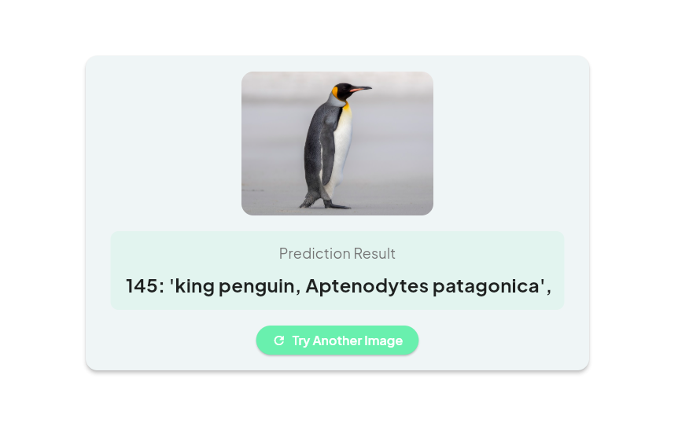

# Image Classification with on-device AI model

[](https://flutter.dev)
[](https://onnxruntime.ai)
[](https://opensource.org/licenses/MIT)

[](http://makeapullrequest.com)

## First, Sample Results!



## Overview
Image Classification with On-Device Inference is a Flutter app that performs image classification using a pre-trained machine learning model running directly on the device. This ensures fast inference and data privacy, with no cloud dependencies for model processing.

## 📋 Features
* **On-device inference:** The pre-trained ONNX model runs entirely on your device
* **Customizable file picker:** Upload images in supported formats: .jpg, .jpeg, .png, .bmp
* **Real-time predictions:** Displays the predicted class along with the probabilities
* **Error handling:** Validates file type, size (max 10MB), and ensures seamless user experience
* **Cross-platform:** Works on both Android and iOS devices

## 🛠️  Tech Stack
* **Framework:** Flutter
* **Model Framework:** ONNX Runtime
* **Packages:**
  * `file_picker`: For selecting image files
  * `onnxruntime`: For running the model locally

## 🚀  How It Works
1. **Select an Image:** Tap the "Upload Image for Inference" button to choose an image file
2. **Run Inference:** The app preprocesses the image and runs it through the ONNX model
3. **View Results:** The app displays the predicted class and confidence probabilities
4. **Error Handling:** If any issues occur (invalid file, processing error), a helpful error message will be shown


## 🖥️ Setup Instructions

### Prerequisites
* Flutter SDK installed 
* ONNX Runtime for Flutter added to your pubspec.yaml

### Clone the Repository
```bash
git clone https://github.com/ThatLinuxGuyYouKnow/Flutter-Image-Classification
cd Flutter-Image-Classification
```

### Install Dependencies
```bash
flutter pub get
```

### Run the App
```bash
flutter run
```

## Limitations
* File size limit: Max image size is 10MB
* Supported formats: Only .jpg, .jpeg, .png, and .bmp files are accepted
* Device compatibility: Requires devices with ONNX Runtime compatibility

## License
This project is licensed under the MIT License. See the LICENSE file for details.
